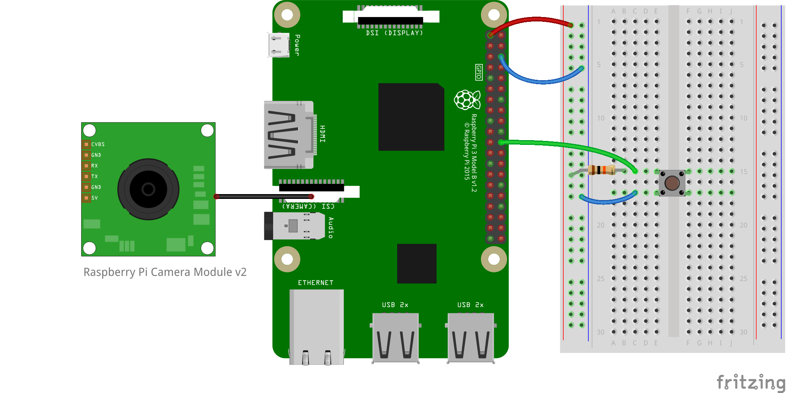

#### 概要

タクトスイッチを押すと、Cameraがスナップショットを撮影する

#### ハードウェア

+ [Raspberry Pi Camera Module V2](https://amzn.to/2Lpk9OW)

#### 画像



#### 設定

+ カメラの設定: https://picamera.readthedocs.io/

#### 実行

```
$ python3 camera_capture_with_button.py
```
